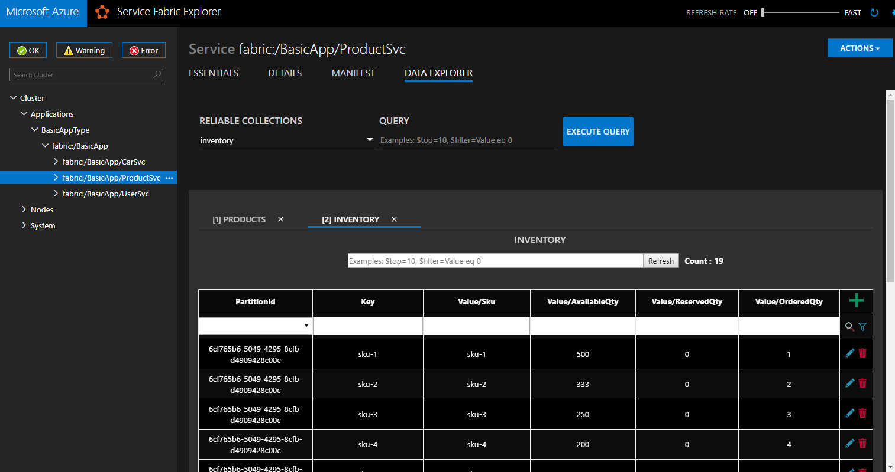

# Microsoft.ServiceFabric.Services.Queryable

Enable Data Explorer and query support for your stateful services in Service Fabric via the OData protocol.  I am actively working on integrating the Data Explorer into the Service Fabric Explorer.  Below is a preview (not yet available) of what it will look like:



Add the ODataQueryable middleware to your stateful services (using ASP.NET Core stateful services), ensure Reverse Proxy is enabled, and start querying your reliable collections.  If your service is named 'fabric:/MyApp/MyService' and your reliable dictionary is named 'my-dictionary', try queries like:

Get OData metadata about a single partition stateful service:
- ```GET http://localhost:19081/MyApp/MyService/query/$metadata```

Get OData metadata about a partitioned stateful service:
- ```GET http://localhost:19081/MyApp/MyService/query/$metadata?PartitionKind=Int64Range&PartitionKey=0```

Get 10 items from the reliable dictionary.
- ```GET http://localhost:19081/MyApp/MyService/query/my-dictionary?$top=10```

Get 10 items with Quantity between 2 and 4, inclusively.
- ```GET http://localhost:19081/MyApp/MyService/query/my-dictionary?$top=10&$filter=Quantity ge 2 and Quantity le 4```

Get 10 items, returning only the Price and Quantity properties, sorted by Price in descending order.
- ```GET http://localhost:19081/MyApp/MyService/query/my-dictionary?$top=10&$select=Price,Quantity&$orderby=Price desc```

## Getting Started

1. Create a stateful ASP.NET Core services.

2. Add the **Microsoft.ServiceFabric.Services.Queryable** nuget package.

3. Add the **ODataQueryable** middleware to your Startup.cs.  This will intercept calls to the /query endpoint to expose OData query capabilities over the reliable collections in your service.

```csharp
using Microsoft.ServiceFabric.Services.Queryable;

public class Startup
{
	public void Configure(IApplicationBuilder app, IHostingEnvironment env, ILoggerFactory loggerFactory)
	{
		...
		app.UseODataQueryable();
		...
	}
}
```

## Samples

- [Basic application with several stateful services](samples/Basic)
